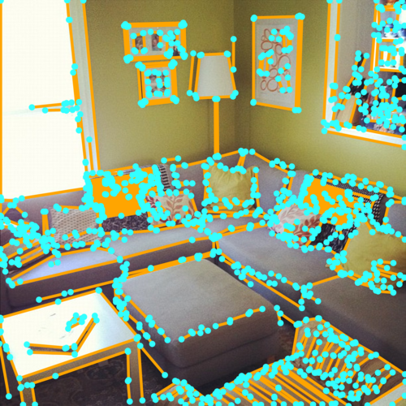
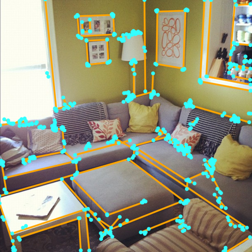
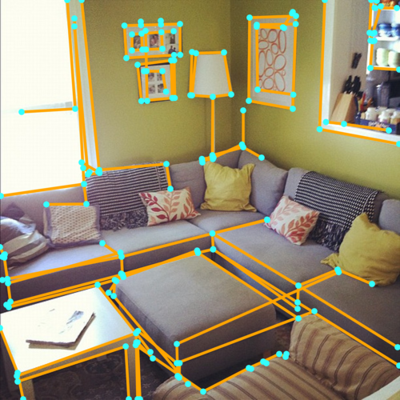
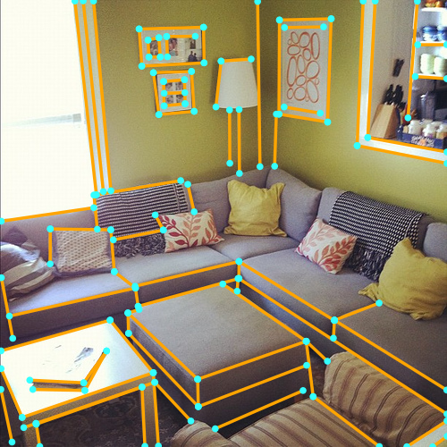
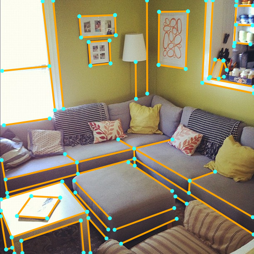
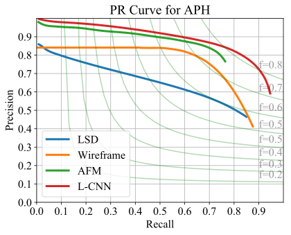
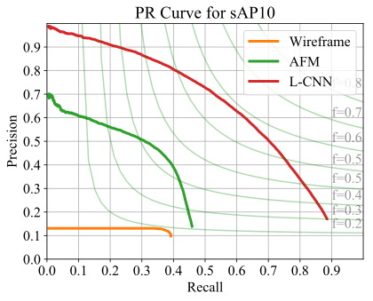

# L-CNN — End-to-End Wireframe Parsing

## Introduction

This repository contains the official PyTorch implementation of [L-CNN](https://arxiv.org/abs/1905.03246), a conceptually simple yet effective neural network-based algorithm for detecting the wireframe from a given image. It outperforms the previous state-of-the-art wireframe and line extraction algorithms by a large margin. We hope that this repository serves as an easily reproducible baseline for future researches in this area.

## Main Results

### Qualitative Measures

|           |        |           |  |  |
| :--------------------------------------------------: | :-----------------------------------------------: | :-------------------------------------------------: | :------------------------------------------: | :----------------------------------------: |
| [LSD](https://ieeexplore.ieee.org/document/4731268/) | [AFM](https://github.com/cherubicXN/afm_cvpr2019) | [Wireframe](https://github.com/huangkuns/wireframe) |                  **L-CNN**                   |                Ground Truth                |

### Quantitative Measures

The following table reports the performance of several wireframe and line detection algorithms on the [Wireframe dataset](https://github.com/huangkuns/wireframe).

|                                                      | Wireframe (sAP<sup>10</sup>) | Wireframe (AP<sup>H</sup>) | Wireframe (F<sup>H</sup>) | Wireframe (mAP<sup>J</sup>) | 
| :--------------------------------------------------: | :--------------------------------: | :-----------------------------: | :----------------------------: | :------------------------------: | 
| [LSD](https://ieeexplore.ieee.org/document/4731268/) |                 /                  |              52.0             |              61.0                |                /                 |              
|  [AFM](https://github.com/cherubicXN/afm_cvpr2019)   |                24.4                |              69.5               |              77.2              |               23.3               |           
| [Wireframe](https://github.com/huangkuns/wireframe)  |                5.1                 |              67.8               |              72.6              |               40.9               |              
|                      **L-CNN**                       |              **62.9**              |            **83.0**             |            **81.6**            |             **59.3**             |               

### Precision-Recall Curves
<p align="center">


</p>

## Code Structure

Below is a quick overview of the function of each file.

```bash
########################### Data ###########################
figs/
data/                           # default folder for placing the data
    wireframe/                  # folder for Wireframe dataset (Huang et al.)
logs/                           # default folder for storing the output during training
########################### Code ###########################
config/                         # neural network hyper-parameters and configurations
    wireframe.yaml              # default parameter for Wireframe dataset
dataset/                        # all scripts related to data generation
    wireframe.py                # script for pre-processing the Wireframe dataset to npz
misc/                           # misc scripts that are not important
    draw-wireframe.py           # script for generating figure grids
    lsd.py                      # script for generating npz files for LSD
    plot-sAP.py                 # script for plotting sAP10 for all algorithms
lcnn/                           # lcnn module so you can "import lcnn" in other scripts
    models/                     # neural network structure
        hourglass_pose.py       # backbone network (stacked hourglass)
        line_vectorizer.py      # sampler and line verification network
        multitask_learner.py    # network for multi-task learning
    datasets.py                 # reading the training data
    metrics.py                  # functions for evaluation metrics
    trainer.py                  # trainer
    config.py                   # global variables for configuration
    utils.py                    # misc functions
eval-sAP.py                     # script for sAP evaluation
eval-APH.py                     # script for APH evaluation
eval-mAPJ.py                    # script for mAPJ evaluation
train.py                        # script for training the neural network
post.py                         # script for post-processing
```

## Reproducing Results

### Installation

For the ease of reproducibility, you are suggested to install [miniconda](https://docs.conda.io/en/latest/miniconda.html) (or [anaconda](https://www.anaconda.com/distribution/) if you prefer) before following executing the following commands. 

```bash
git clone https://github.com/zhou13/lcnn
cd lcnn
conda create -y -n lcnn
source activate lcnn
# Replace cudatoolkit=10.0 with your CUDA version: https://pytorch.org/get-started/
conda install -y pytorch cudatoolkit=10.0 -c pytorch
conda install -y tensorboardx -c conda-forge
conda install -y pyyaml docopt matplotlib scikit-image opencv
mkdir data logs post
```

### Downloading data
Make sure `curl` is installed on your system and execute
```bash
cd data
../misc/gdrive-download.sh 1T4_6Nb5r4yAXre3lf-zpmp3RbmyP1t9q wireframe.tar.xz
tar xf wireframe.tar.xz
rm *.xz
cd ..
```

If `gdrive-download.sh` does not work for you, you can download the data manually from [Google
Drive](https://drive.google.com/drive/u/1/folders/1rXLAh5VIj8jwf8vLfuZncStihRO2chFr) and proceed
accordingly.

### Training
To train the neural network on GPU 0 (specified by `-d 0`) with the default parameters, execute
```bash
python ./train.py -d 0 --identifier baseline  config/wireframe.yaml
```

### Pre-trained Models

You can download our reference pre-trained models from [Google
Drive](https://drive.google.com/file/d/1NvZkEqWNUBAfuhFPNGiCItjy4iU0UOy2).  This model was trained
with `config/wireframe.yaml` for 312k iterations.

### Post Processing

To post processing the output from neural network (only necessary if you are going to evaluate AP<sup>H</sup>), execute
```bash
python ./post.py --plot logs/RUN/npz/ITERATION post/RUN-ITERATION
```
where ``--plot`` is an *optional* argument to control whether the program should also generate
images for visualization in addition to the npz files that contain the line information. You should
replace `RUN` and `ITERATION` to the desired value of your training instance.

### Evaluation

To evaluate the sAP (recommended) of all your checkpoints under `logs/`, execute
```bash
python eval-sAP.py logs/*/npz/*
```

To evaluate the mAP<sup>J</sup>, execute
```bash
python eval-mAPJ.py logs/*/npz/*
```

To evaluate AP<sup>H</sup>, you first need to post process your result (see the previous section).
In addition, **MATLAB is required for AP<sup>H</sup> evaluation** and `matlab` should be under your
`$PATH`.  The **parallel computing toolbox** is highly suggested due to the usage of `parfor`.
After post processing, execute

```bash
python eval-APH.py post/RUN-ITERATION post/RUN-ITERATION-APH
```
to get the plot.  Here `post/RUN-ITERATION-APH` is the temporary directory storing intermediate
files.  Due to the usage of pixel-wise matching, the evaluation of AP<sup>H</sup> **may take up to
an hour** depending on your CPUs.

See the source code of `eval-sAP.py`, `eval-mAPJ.py`, `eval-APH.py`, and `misc/*.py` for more
details on evaluation.

### Citing End-to-End Wireframe Parsing

If you find L-CNN useful in your research, please consider citing:

```
@article{zhou2019end,
    Author = {Yichao Zhou, Haozhi Qi, Yi Ma},
    Title = {End-to-End Wireframe Parsing},
    Journal = {arXiv preprint arXiv:1905.03246},
    Year = {2019}
}
```
